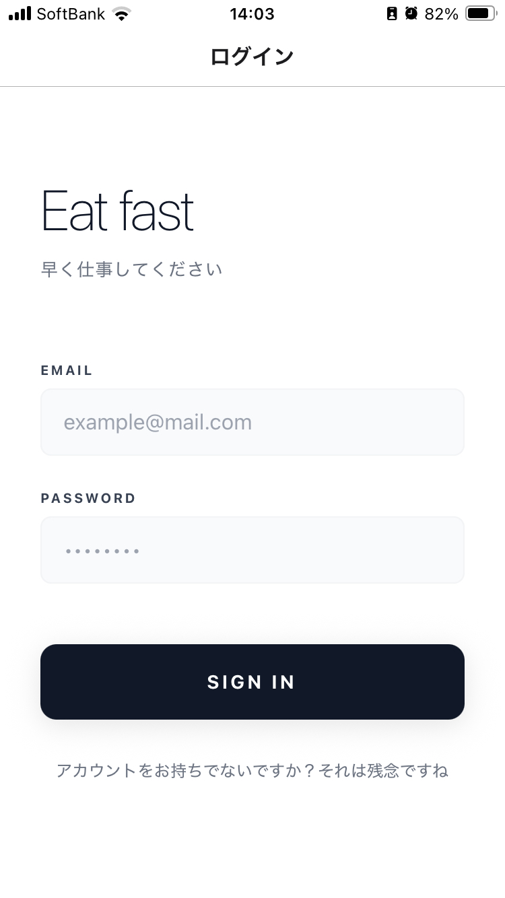

# Accounting App 01 📱

### [JP] 会計アプリ
### [EN] A minimal and practical accounting management app

TypeScript と React Native (Expo) を使用して、日々の支出をストレスなく最速で記録することを目的に頑張りました。
Developed with TypeScript and React Native (Expo) to achieve the fastest possible expense tracking for daily use.

---

## 📸 Screenshots

  <table>
    <tr>
      <td align="center"><b>Login Screen</b></td>
      <td align="center"><b>Home / Summary</b></td>
    </tr>
    <tr>
      <td></td>
      <td></td>
    </tr>
  </table>

---

## ✨ Features / 主な機能

- **⚡️ Speedy Entry / 素早い入力**
  - **JP**: 複雑な設定を排除し、秒で記帳が完了するインターフェース。
  - **EN**: Minimal interface designed for intuitive and effortless data entry within seconds.

- **🛡️ Type Safe / 型安全な設計**
  - **JP**: TypeScript をフル活用し、堅牢でメンテナンス性の高いコードベースを実現。
  - **EN**: Robust implementation with 100% type safety using TypeScript.

- **🚀 Ready to Dev / すぐに開発可能**
  - **JP**: Expo を採用しているため、環境構築が容易で誰でもすぐに試せます。
  - **EN**: Instant development environment setup thanks to the Expo ecosystem.

---

## 🛠️ Tech Stack / 使用技術

- **Frontend**: React Native
- **Framework**: Expo
- **Language**: TypeScript (100%)
- **Styling**: StyleSheet (Native)

---

## 🚀 How to Run / 起動方法

### Prerequisites
- Node.js
- npm or yarn
- Expo Go app on your smartphone

